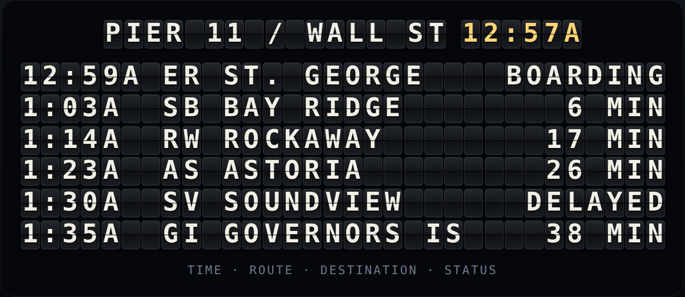

# splitflap

A split-flap departure board for the web — the clacky Solari kind you stand under in a train
station. Zero dependencies, no build step, about 6 kB of source.



Live demo: open [`docs/index.html`](docs/index.html) in a browser, or run `npm run demo`.

## Why it flips the way it does

A real split-flap unit is a drum of printed flaps and a motor that only turns one way. To show a
`C` when it is showing an `X`, it has to clack through every character in between. That constraint
is the entire aesthetic, so the engine keeps it: a flap advances exactly one position per tick and
wraps past the end of the drum, and a board is just a grid of those.

The drum is blank, `A–Z`, `0–9`, then punctuation — 52 positions, so a worst-case character takes
51 ticks.

## Use it as a web component

```html
<script type="module" src="src/element.js"></script>

<split-flap id="board" rows="3" cols="24" stagger="1" fps="18" sound></split-flap>

<script type="module">
  const board = document.querySelector('#board');
  board.lines = ['PIER 11 / WALL ST', '7:04P  ER  ST. GEORGE', '16 MIN'];
</script>
```

| attribute | default | what it does |
| --- | --- | --- |
| `rows` | number of lines | how many rows of flaps |
| `cols` | `12` | characters per row; text is padded or clipped to fit |
| `stagger` | `0` | ticks of lag added per column, which gives the board its left-to-right wave |
| `fps` | `14` | frames per second — how fast it clacks |
| `sound` | off | a synthesized clack per flip, via Web Audio |

Properties: `lines` (`string[]`, assign to change the board) and `align` (`'left' | 'right' |
'center'`). It fires a `settled` event when the last flap comes to rest, and keeps an `aria-label`
with the current text so a screen reader gets the board rather than 700 loose characters.

## Use the engine on its own

The engine has no DOM in it, so it runs anywhere — a terminal board, a canvas, a test.

```js
import { Board } from 'splitflap';

const board = new Board({ rows: 2, cols: 12, stagger: 1 });
board.setLines(['NOW BOARDING', 'PIER 11'], 'center');

while (!board.settled) {
  board.tick();
  console.log(board.lines().join('\n'));
}
```

- `board.tick()` — advance one frame; returns whether anything visibly moved
- `board.lines()` — what it is showing right now
- `board.remaining` — frames until the last flap rests, so you can time other things to it
- `board.run(maxTicks)` — run to rest in one go; throws rather than spinning forever
- `board.settle()` — snap to the target with no animation

Lower level, `Flap` and `distance(from, to)` from `splitflap` give you a single unit.

## Layout

```text
src/flap.js      one unit: the drum, forward-only stepping, start delay
src/board.js     a grid of units: padding, alignment, the stagger wave
src/element.js   <split-flap>: shadow DOM, the flip animation, the clack
demo/            the harbor board — a live schedule that counts down and rolls over
docs/index.html  the same demo, inlined into one file by scripts/bundle.js
test/            node --test, no runner to install
```

## Commands

```sh
npm test        # 14 tests, no dependencies
npm run demo    # serve the demo at http://localhost:8080
npm run build   # regenerate docs/index.html from src/ and demo/
```

MIT.
